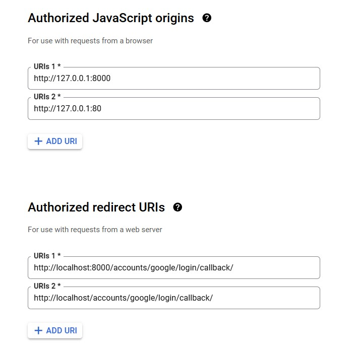

# Book My Ticket
## Installation

### Development
1. Start a virtual env and activate it:
```
python -m venv .venv
```
2. Install required modules:
```
pip install requirements.txt
```
3. Create .env file of the following format:
```
CLIENT_ID=
CLIENT_SECRET=
DEBUG=1
SECRET_KEY=
DJANGO_ALLOWED_HOSTS=localhost 127.0.0.1 [::1]
DATABASE=postgres
SQL_ENGINE=django.db.backends.postgresql
SQL_DATABASE=
SQL_USER=
SQL_PASSWORD=
SQL_HOST=db
SQL_PORT=5432
EMAIL_ID=
APP_PWD=
MIGRATE=0
```
Get CLIEND_ID and CLIENT_SECRET from google oauth api
EMAIL_ID and APP_PWD from google security settings

Configure the oauth settings as the following:


4. Run the following in root directory:

```
docker-compose up -d --build
```

5. Test the app at http://localhost:8000

6. Create superadmin:
```
docker exec bookmyticket-web-1 python manage.py createsuperuser --noinput
```

### Production
1. Create .env.prod and .env.prod.dev
Duplicate .env to .env.prod and add a .env.prod.db:
```
POSTGRES_USER=superuser
POSTGRES_PASSWORD=123456
POSTGRES_DB=bookmyticket
```

2. First stop the development containers:
```
docker-compose down
```

3. Start the production containers:

```
docker-compose -f docker-compose.prod.yml up -d --build
```

4. Perform migrations (if any) by repeating the same process as in development.

5. Test the server at http://localhost

## Walkthrough
https://youtu.be/YzNGsqDOGKg

## Docker commands
Some docker commands I used:
```
docker-compose build --> For building containers
docker-compose up -d --> Runs containers while detached
docker-compose up -d --build --> Effectively combines the above 2 commands
docker-compose pull --> Pull images
docker-compose exec <service> <some command> --noinput --> To run a certain command in the service-specific container
docker-compose -f <custom compose file> .... --> Used for compose files with different name or address than ./docker-compose.yml

docker exec -ti <postgres_container_name> psql -U <username> --> To open psql cmd line in terminal. Useful for checking if migrations have been applied
docker exec -it <django_container> /bin/bash --> Run commands (python manage.py .. ones)

docker volume inspect <volume name> --> To inspect volume info

docker system prune --> To reclaim system memory
```
Instead of docker exec.., I found opening Docker Desktop, going to the container and going to 'exec' and executing my commands there more convenient.